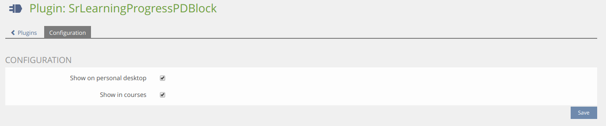

# SrLearningProgressPDBlock ILIAS Plugin

Add learning process of coursed to dashboard

This project is licensed under the GPL-3.0-only license

## Requirements

* ILIAS 6.0 - 7.999
* PHP >=7.2

## Installation

Start at your ILIAS root directory

```bash
mkdir -p Customizing/global/plugins/Services/UIComponent/UserInterfaceHook
cd Customizing/global/plugins/Services/UIComponent/UserInterfaceHook
git clone https://github.com/fluxapps/SrLearningProgressPDBlock.git SrLearningProgressPDBlock
```

Update, activate and config the plugin in the ILIAS Plugin Administration

## Description

Display learn progress as a pie diagramm on personal desktop and in courses

Config:


Dashboard:


Course:

